# Issue #169 Icon Replacement Catalog (Batch 2 - ColorBold)

This batch replaces the prior monochrome proposal direction with bolder, color-coded, scalable SVG candidates.
Updated with owner-requested refinements on 2026-03-17.

Approval workflow:

1. Review each row (current vs proposed).
2. Approve or reject per icon.
3. Only approved rows will be applied to production icon paths.

Source set:

- Material Design Icons SVG set
- Candidate folder: ../../UI/Assets/Proposed/ColorBold
- License note: ../../UI/Assets/Proposed/ColorBold/LICENSE-MDI.txt

## Status and Action Icons (Color-Coded)

| Current | Proposed (ColorBold SVG) | Mapping | Color Intent |
|---|---|---|---|
|  |  | Help.png -> help-circle | Info/help blue |
|  |  | Warning.png -> alert | Warning yellow |
|  |  | Error.png -> alert-circle | Error red |
|  |  | Record.png -> record-circle | Record red circle |
|  |  | MediaPlay.png -> play | Play green triangle |
|  |  | MediaPause.png -> pause | Pause yellow bars |
|  |  | MediaStop.png -> stop | Stop red square |
|  |  | Close.png -> close | Red X |

## Core Utility Icons

| Current | Proposed (ColorBold SVG) | Mapping | Color Intent |
|---|---|---|---|
|  |  | Settings.png -> cog | Neutral slate |
|  |  | Find.png -> magnify | Search teal |
|  |  | Refresh.png -> refresh | Refresh blue |
| 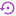 |  | ResetSettings.png -> backup-restore | Lighter bold purple |
|  |  | Folder.png -> folder | Folder amber |
|  |  | Script.png -> script-text | Script indigo |
|  |  | LogWindow.png -> file-document-outline | Log slate |
|  |  | Debugger.png -> bug | Debug green |
|  |  | Speed.png -> speedometer | Perf teal |
|  |  | HistoryViewer.png -> history | History brown |
|  |  | VideoOptions.png -> video-outline | Video blue |
|  |  | Repeat.png -> repeat | Repeat blue |

## Second Pass: Next Highest-Usage Group

| Current | Proposed (ColorBold SVG) | Mapping | Color Intent |
|---|---|---|---|
|  |  | CheatCode.png -> code-tags | Cheats purple accent |
| 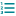 | 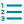 | Enum.png -> format-list-numbered | Enum teal accent |
|  |  | Edit.png -> pencil | Edit amber accent |
|  |  | Drive.png -> harddisk | Drive slate accent |
| 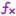 |  | Function.png -> function-variant | Function purple accent |
|  |  | NextArrow.png -> chevron-right | Next blue accent |
|  |  | PreviousArrow.png -> chevron-left | Previous blue accent |

## Third Pass: System/Platform + Frequent Utility Group

Revised after owner feedback to replace generic gamepad glyphs with platform-specific custom SVG designs.

| Current | Proposed (ColorBold SVG) | Mapping | Color Intent |
|---|---|---|---|
|  |  | NesIcon.png -> custom NES console mark | NES gray shell + red slot accent |
|  |  | SnesIcon.png -> custom SNES 4-color logo mark | SNES iconic 4-color symbol (no text) |
|  | 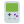 | GameboyIcon.png -> custom DMG-style handheld | GB gray body + green screen |
|  |  | GbaIcon.png -> custom GBA handheld | GBA purple shell palette |
|  |  | PceIcon.png -> custom PC Engine console mark | PCE light shell + orange accent |
|  | 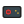 | SmsIcon.png -> custom Master System console mark | SMS black console + red dial motif |
|  | 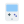 | WsIcon.png -> custom WonderSwan handheld | WS light handheld + blue display |
|  | 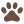 | LynxIcon.png -> paw | Lynx brown accent |
|  |  | EditLabel.png -> label-outline | Label purple accent |
|  |  | Add.png -> plus-thick | Add green accent |
|  |  | Copy.png -> content-copy | Copy indigo accent |
| 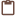 | 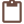 | Paste.png -> content-paste | Paste brown accent |
|  |  | Reload.png -> reload | Reload blue accent |
|  |  | SaveFloppy.png -> content-save | Save blue accent |
| 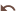 | 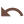 | Undo.png -> undo | Undo brown accent |

## Notes

- Candidate assets only. No production icon references were changed.
- This batch intentionally uses stronger fills and color coding versus thin black outlines.
- Help icon uses a white question glyph on blue for better contrast, with a slightly smaller question mark.
- Batch 2 glyphs are slightly scaled up for better readability, with an extra-bold larger close X.
- Second-pass icons continue the same ColorBold visual language for additional high-usage assets.
- Third-pass icons continue the same ColorBold visual language for platform/system and utility assets.
- Platform/system icons were redesigned again to avoid generic/janky controller silhouettes and emphasize system identity.
- Latest refinement pass adjusted SNES to a no-background 4-color logo-style mark with corrected color order and revised shape proportions.
- Latest refinement pass enlarged the Game Boy icon slightly and reworked NES, GBA, PCE, SMS, and WonderSwan for closer system-identity cues.
- Latest micro-pass added SNES logo cutouts on blue/red petals and further tuned NES, GBA, PCE, SMS, and WonderSwan silhouettes toward more faithful system marks.
- Implementation status (2026-03-18): all currently approved B2 rows from the approval sheet are implemented in `UI/Assets` and are in sync with `UI/Assets/Proposed/ColorBold`.
- If approved, the next step is to replace icon paths in small grouped commits and validate after each group.

## Easy-Win Backlog (Unsigned Icons)

The following icons are not yet signed off in Issue #169 and remain PNG-only.

Priority A (high usage, straightforward MDI mappings):

- Breakpoint, BreakpointDisabled, BreakpointEnableDisable, ForbidBreakpoint
- NextCode, NextData, NextExec, NextRead, NextTrack, NextUnknown, NextWrite
- PrevCode, PrevData, PrevExec, PrevRead, PrevTrack, PrevUnknown, PrevWrite
- StepInto, StepOut, StepOver, StepBack, StepBackFrame, StepBackScanline, StepIrq, StepNmi
- RunCpuCycle, RunPpuCycle, RunPpuFrame, RunPpuScanline
- EventViewer, PerfTracker, RegisterIcon, VideoFilter, VideoRecorder

Priority B (low risk, mostly one-to-one symbol replacements):

- Accept, Exclamation, Expand, Export, Import, SelectAll, Update
- MoveUp, MoveDown, RotateLeft, RotateRight, TranslateUp, TranslateDown, TranslateLeft, TranslateRight
- Fullscreen, SplitView, SwitchView, VerticalLayout, TabContent
- Camera, Microphone, Network, CommandLine, WebBrowser

## New Recommendation Wave (2026-03-18, Unsigned)

These proposal-only SVGs were generated for the next owner sign-off pass. They are not promoted to production paths yet.

| Current | Proposed (ColorBold SVG) | Mapping | Color Intent |
|---|---|---|---|
|  |  | Accept.png -> check-bold | Confirm green |
|  |  | Exclamation.png -> alert-circle | Caution yellow |
|  |  | Expand.png -> arrow-expand-all | Expand blue |
|  |  | Export.png -> export | Export teal |
|  |  | Import.png -> import | Import teal |
|  | 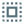 | SelectAll.png -> select-all | Selection slate |
|  |  | Update.png -> update | Update blue |
|  | 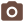 | Camera.png -> camera | Capture brown |
|  |  | Microphone.png -> microphone | Audio purple |
|  |  | WebBrowser.png -> web | Web blue |

Wave summary:

- Generated proposals: 10
- Generation status: all entries reported `ok`
- Promotion status: pending owner sign-off

Priority C (defer for custom treatment):

- Controller, Keyboard, ArrowKeys, WasdKeys
- MenuItemChecked, MenuItemCheckedDark
- Console-specific debugger badges (Cx4Debugger, GsuDebugger, NecDspDebugger, Sa1Debugger, SpcDebugger, St018Debugger, GameboyDebugger, PsIcon, XbIcon)
- Branding/splash assets (NexenIcon, SplashLogo)
